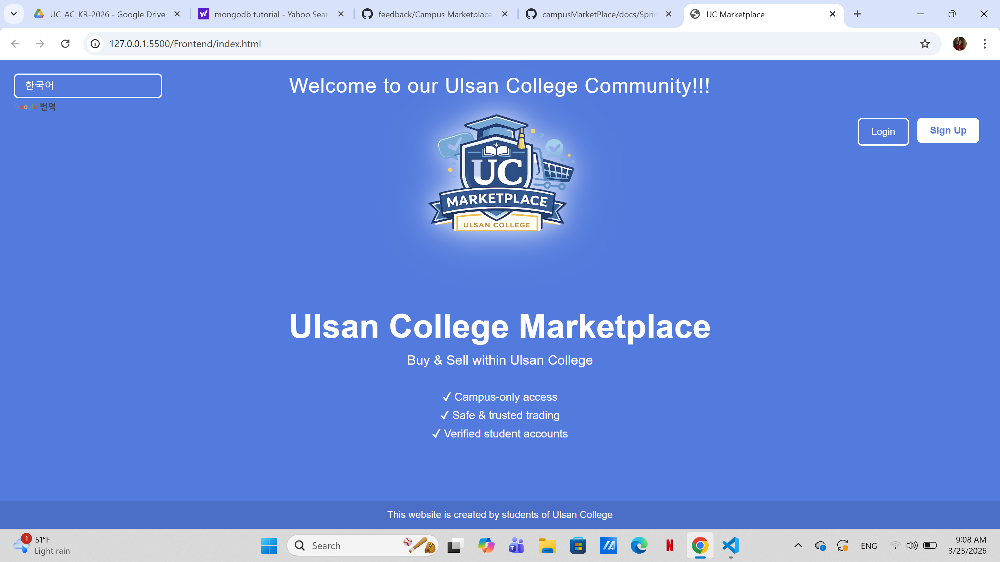
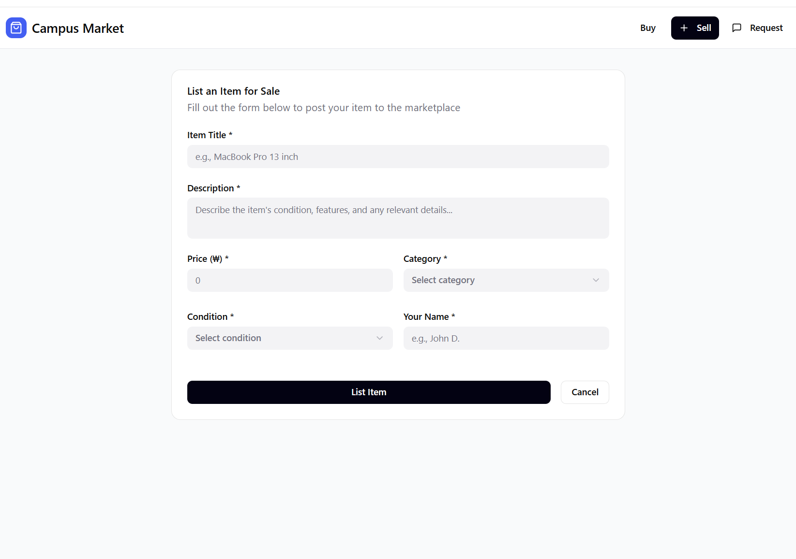

# Design Doc v1

## 1) Project purpose
**One-sentence summary:**
This is a campus-focused marketplace where students can buy, sell, and request second-hand items safely within their university community.

**Why this matters:**
Students often struggle to find affordable items and trustworthy buyers/sellers within campus. This  campus marketplace provides a safe, verified, and convenient environment specifically designed for our needs.

---

## 2) Target users
- Primary user: University students on campus  
- Secondary user (if any): International or exchange students  
- What they need:
  - Affordable second-hand items  
  - Safe and trusted transactions  
  - Easy way to connect with others
---

## 3) MVP scope

### In scope now
- User registration and login  
- Campus email validation (with @office.uc.ac.kr)  
- Create and post item listings  
- Browse and search items  
- View item details  
- tutoring  

### Out of scope for now
- Online payment system  
- Delivery/shipping system  
- Mobile application  
- Advanced recommendation system  

---

## 4) Core user flow

1. User opens the website  
2. User signs up using campus email  
3. User logs in to their account  
4. User browses or posts an item  
5. User contacts seller to arrange exchange  

---

## 5) Architecture (C4-lite)

https://github.com/CapstoneDesign-Spring2026-UlsanCollege/campusMarketPlace/blob/main/docs/Architecture_sketch.md

### Context view
- users: Students (both buyers and sellers)  
- main system: Campus Exchange Marketplace  
- outside systems/services: Web browser, hosting platform  

### Container view
- frontend: HTML, CSS, JavaScript  
- backend: Flask (Python)  
- database: mongoDB  
- other service (if needed): –  

### Diagram or image

---

## 6) Wireframes
https://github.com/CapstoneDesign-Spring2026-UlsanCollege/campusMarketPlace/blob/main/docs/WIREFRAME.md

## Screen 1 - Entry / Home
**Screen name:** Home / Marketplace (Buy Page)

**Purpose:**
This screen allows users to browse available items and search for products within the campus marketplace.

**Main user action:**
Browse items or search for a specific product.  
- image / sketch:

---

## Screen 2 - Core Task

**Screen name:** Sell Item Page

**Purpose:**
Allows users to create and submit a new item listing for sale.

**Main user action:**
Fill out the form and submit an item.
- image / sketch:

---
## Screen 3 - Result / Detail / Confirmation

**Screen name:** Item Request Page

**Purpose:**
Displays active item requests and allows users to post new requests.

**Main user action:**
View requests or post a new request.

- image / sketch:

---

## 7) Sprint 1 plan

### Top goals
1. Set up project repository and structure  
2. Build basic frontend pages (Home, Login, Signup)  
3. Set up backend with Flask  

### Initial issues / work chunks
- Issue: Create GitHub repo and folder structure  
- Issue: Design wireframes  
- Issue: Build homepage UI  
- Issue: Create login and signup UI  

---

## 8) Risks / assumptions

### Risks
- Difficulty integrating frontend with backend  
- Limited experience with Flask and database  

### Assumptions
- All users have a valid campus email  
- Basic features are enough for MVP demo  

---

## 9) Scope cut list

If time runs short, cut these first:
- Messaging system (simplify to contact info)  
- Advanced UI design improvements  

---

## 10) Evidence links

- Board link:
- Sprint Packet link: https://github.com/CapstoneDesign-Spring2026-UlsanCollege/campusMarketPlace/blob/main/docs/Sprint_Packet/sprint3.md  
- Related issues:
  
- Related PRs (later):  

---

## 11) Quality check

- [x] project purpose is clear  
- [x] target users are specific  
- [x] MVP scope is realistic  
- [x] architecture is included  
- [x ] 3 wireframes are included  
- [x] Sprint 1 goals are small enough to demo  
- [x] risks are honest  
- [ ] evidence links are included where possible  

