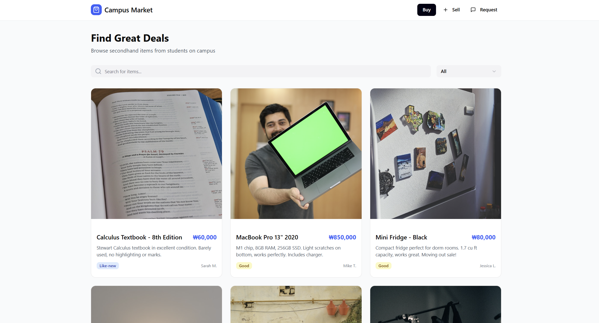
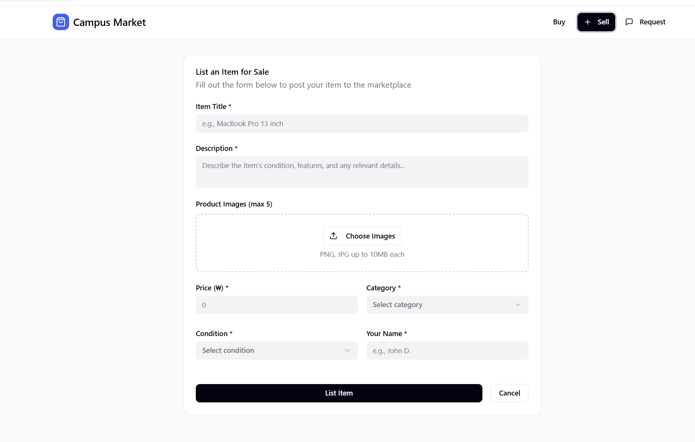
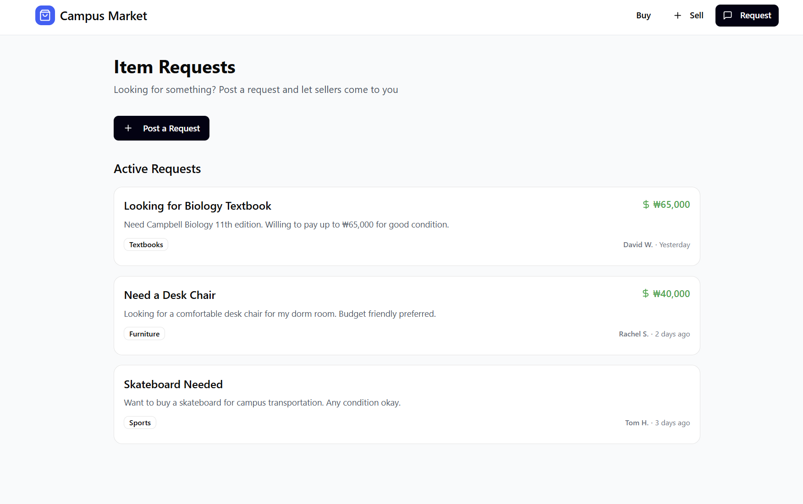

# Wireframes

---

## Screen 1 - Entry / Home
**Screen name:** Home / Marketplace (Buy Page)

**Purpose:**
This screen allows users to browse available items and search for products within the campus marketplace.

**Main user action:**
Browse items or search for a specific product.

**What appears on this screen:**
- title: Campus Market / Find Great Deals  
- short description: Browse secondhand items from students on campus  
- input/search/filter area: Search bar + category filter  
- main button: Item cards (click to view details)  
- optional navigation: Buy | Sell | Request  

**What happens next:**
User clicks on an item → goes to item detail page or contacts seller.

### Screenshot

## Screen 2 - Core Task

**Screen name:** Sell Item Page

**Purpose:**
Allows users to create and submit a new item listing for sale.

**Main user action:**
Fill out the form and submit an item.

**What appears on this screen:**
- key content: Item listing form  
- form / interaction area:
  - Item title  
  - Description  
  - Price  
  - Category  
  - Condition  
  - Seller name  
- main action button: List Item  
- validation or feedback note: Show error if required fields are missing  

**What happens next:**
After submitting → item is added to marketplace and visible on the home page.

### Screenshot

## Screen 3 - Result / Detail / Confirmation

**Screen name:** Item Request Page

**Purpose:**
Displays active item requests and allows users to post new requests.

**Main user action:**
View requests or post a new request.

**What appears on this screen:**
- result / saved data / detail: List of active requests  
- confirmation or status message: Request successfully posted (optional)  
- next action button: Post a Request  
- fallback or error note if needed: Show message if no requests exist  

**What happens next:**
User posts a request → it appears in the list for other users to see and respond.

### Screenshot

